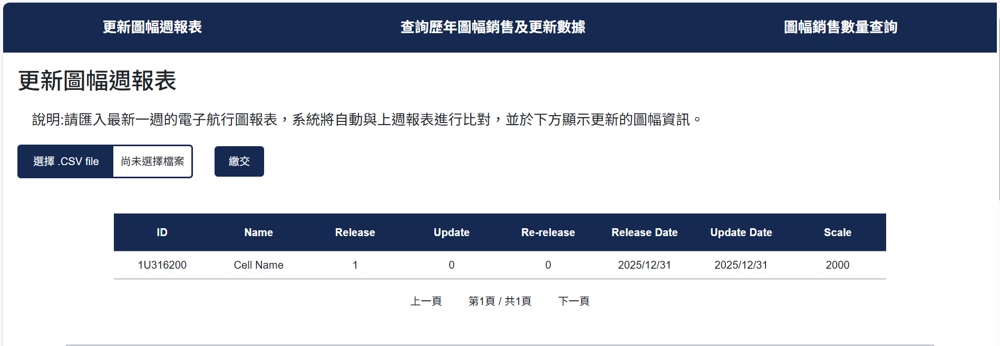
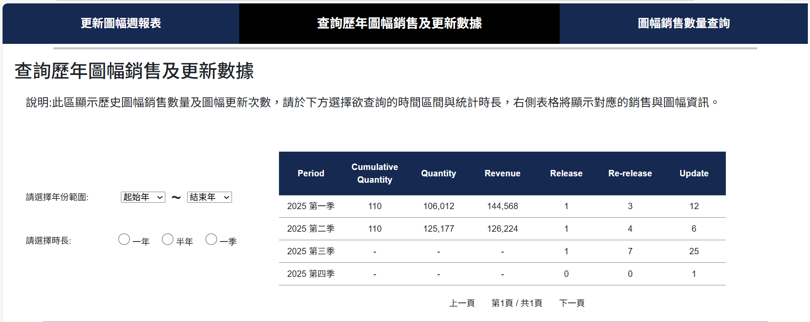
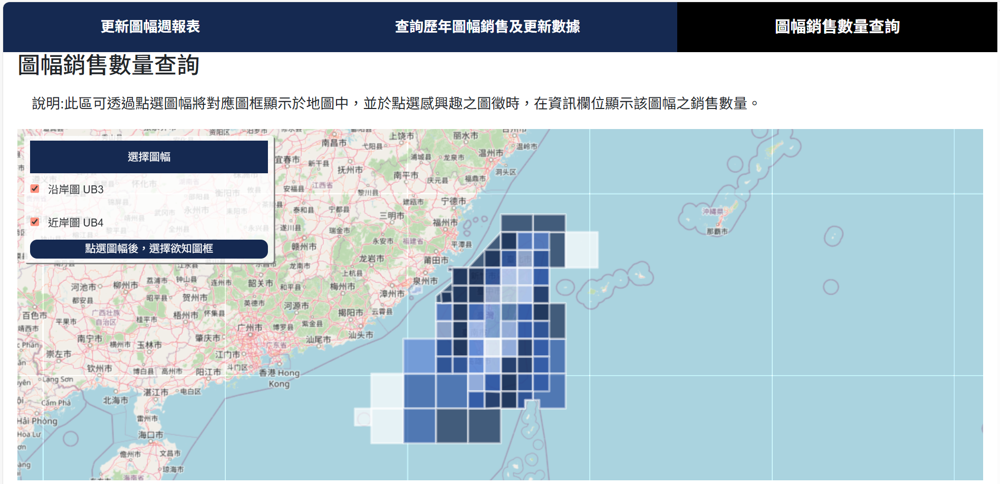

## 圖幅版次維護與銷售資訊查詢工具

### 專案簡介（Overview）
圖幅版次維護與銷售資訊查詢工具，目的在於改善既有以人工維護 Excel 的作業流程，
透過系統化與自動化方式提升工作效率、降低人為錯誤，並簡化資料查詢之人力。
### 功能概述   
1. 更新圖幅週報表  
將人工比對與更新的 Excel 流程重構為 Web 工具，自動比對每週更新的圖幅版次，
並將結果寫入資料庫進行歷史紀錄追蹤。

2. 查詢歷年圖幅銷售及更新數據  
使用者可依據指定年份區間與累積統計時長，即時查詢歷年圖幅銷售數據與版次更新資訊，
用於內部報告製作與決策分析。
3. 圖幅銷售數量查詢  
 除上述功能外，亦嘗試整合圖幅銷售數據與圖幅框之地理空間資料，將銷售數據以互動地圖呈現，
   使用者可點選圖幅，即時查看資訊與銷售量，快速掌握各區域銷售熱度。
---

### 操作示範(Demo)
#### 更新圖幅週報表  
    功能說明:    
    1. 上傳每週版次報表，系統自動解析內容
    2. 自動比對版次更新，快速找出新增或修改的圖幅
    3. 將比對結果更新至資料庫，保留歷史紀錄
[▶ 更新圖幅週報表操作影片](https://drive.google.com/file/d/1zet4Gl6PrOnZIKPSTw7Kk6l5J9uc4WMa/view?usp=sharing)  


#### 查詢歷年圖幅銷售及更新數據   
    功能說明:    
    1. 使用者可選擇起始年份、結束年份及統計時長
    2. 即時顯示所選期間的累計發行量、總授權數、總收入，以及圖幅的新版本、再版與更新數據  
[▶查詢歷年圖幅銷售及更新數據操作影片](https://drive.google.com/file/d/1zA6bj3wclzhVhc4UP0h3kA9_YLSAnoCq/view?usp=sharing)  


#### 圖幅銷售數量查詢  
    功能說明:    
    1. 點選任意圖幅，即時查看該圖幅的詳細資訊與銷售量
    2. 以互動式地圖呈現不同區域的圖幅銷售熱度，以掌握圖幅需求之區域  
[▶ 圖幅銷售數量查詢操作影片](https://drive.google.com/file/d/17INABbLUBScKOxhKkrbac6MN4ibg6Gze/view?usp=sharing)  



---

### 使用技術
-  前端：HTML / CSS / JavaScript 
-  後端：Node.js/ Express 
-  資料庫：MSSQL
---

### 專案結構
```
project  
├─ bin/                     # 程式進入點  
│
├─ node_modules/            # 套件 (npm install 會自動生成)  
├─ package.json             # 記錄套件與專案的設定  
├─ app.js                   # 主程式，設定 Express  
│ 
├─ public/                  # 前端程式  
│  ├─ index.html  
│  ├─ javascripts/  
│  └─ stylesheets/  
│  
└─ src/                     # 後端程式  
   ├─ routes/ 
   ├─ controllers/ 
   ├─ services/  
   └─ config/               # DB設定  
```
>資料來源說明：
>文件中使用的資料部分來自公開資料集，未公開或敏感資料則以模擬資料呈現。
>所有資料僅用於展示工具功能與操作示範。